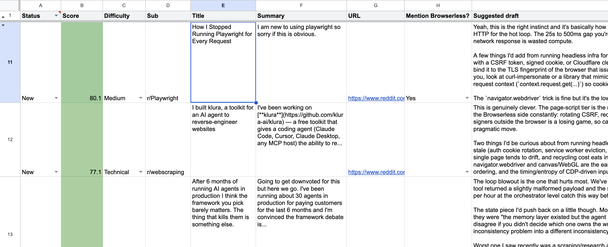
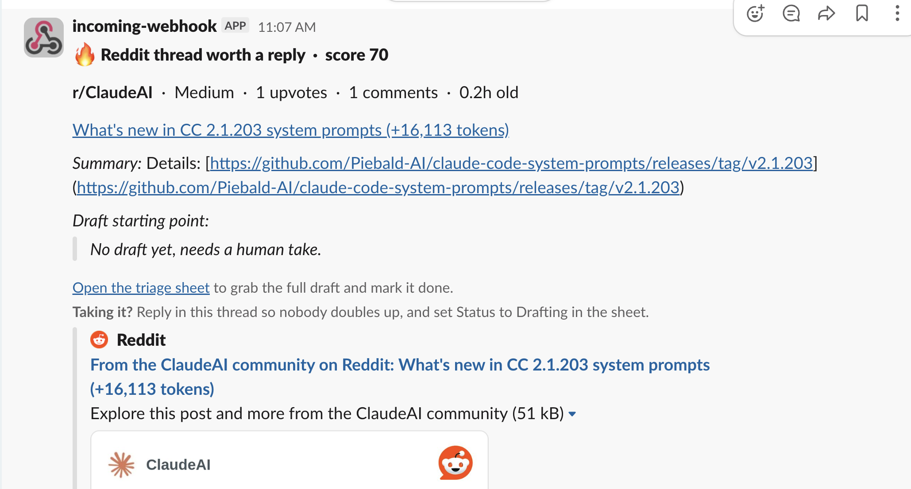

# Reddit Social Listener

[](LICENSE) 

Surfaces relevant Reddit threads into a shared master Google Sheet where you
(or your team) can pick up a thread and draft a reply. Runs on an hourly cron
and optionally uses [Browserless](https://browserless.io) for reliable
cloud-IP fetching and live docs grounding - swap that piece out if you'd
rather use something else.

This started as an internal tool for surfacing Reddit threads relevant to a
browser-automation product; this repo is the genericized template version.
Everything product-specific lives in `config.yml` - copy it, fill in your
own persona and keywords, and it's yours.

## What it looks like

Threads land in a shared triage sheet, scored and pre-drafted:



High scorers also ping Slack so nobody misses a hot thread:



## What it does

Hourly cron job that:

1. Sweeps target subs via Reddit's public JSON API
2. Scores posts by buyer-intent keywords + engagement
3. Classifies difficulty (Easy / Medium / Technical) so a team can split up who answers what
4. Optionally renders the OP's profile page (account age + karma) to filter throwaway accounts
5. For Technical threads, optionally searches your own docs site for grounding context
6. Drafts a starter reply via Claude using your configured voice/persona
7. Appends a row to the master Google Sheet
8. Fires a Slack alert for threads above your alert threshold (optional)

You (or your team) pick rows out of the sheet, edit the draft, post the
reply, and fill in the Posted URL column.

## The draft is a starting point, never the reply

The Suggested draft column exists to kill the blank-page problem, not to
be copy-pasted. My rule, and the one I'd suggest if you run this template:
no draft goes out as-is. Ever.

Before posting, every reply gets:

- A rewritten intro. The model's opening line is always the weakest part
  and the most recognizable as generated.
- Something only I could add - a real project, a mistake I actually made,
  a number from my own usage. If I can't add anything personal, I skip
  the thread.
- A pass in my own voice. If a sentence doesn't sound like something I'd
  say out loud, it gets rewritten or cut.

Two reasons. Reddit is very good at smelling generated text, and one
called-out comment does more damage than fifty good ones do good. And
the drafts are grounded in the thread but not in your actual experience -
the model doesn't know what you shipped last week or which workaround
you personally hit. That part is the whole value of replying at all.

Treat the draft as a researcher handing you notes: it read the thread,
checked the top comments, and sketched an angle. The take still has to
be yours.

## Project structure

```
reddit-social-listener/
├── README.md                  # this file
├── DEPLOY.md                  # step-by-step deployment walkthrough
├── CONTRIBUTING.md            # how to contribute
├── AGENTS.md                  # instructions for AI coding agents
├── config.yml                 # persona, sub list, keywords, scoring thresholds - START HERE
├── setup.sh                   # one-command: venv + deps + .env + dry run
├── listener.py                # main cron entry
├── requirements.txt
├── .env.example
├── .github/
│   └── workflows/
│       └── listener.yml       # hourly GitHub Actions cron
├── apps_script/
│   └── SheetWriter.gs         # Apps Script web app for sheet writes
├── docs/                      # screenshots used in this README
├── src/
│   ├── reddit_client.py       # Reddit JSON API wrapper
│   ├── browserless_client.py  # optional: OP profile lookup + docs search via Browserless
│   ├── scorer.py              # fit + difficulty + Mention Product? classification
│   ├── drafter.py             # Claude API drafting with your configured voice rules
│   ├── slack_notifier.py      # optional: high-score thread alerts to Slack
│   ├── sheet_writer.py        # POST rows to Apps Script
│   └── db.py                  # SQLite seen-list cache
└── scripts/
    ├── smoke_test.py          # one-off: verify the sheet-writer endpoint works
    └── seed_example_rows.py   # one-off: write a placeholder row to confirm the pipeline
```

## Quick start

Roughly 15 minutes from clone to your first surfaced thread. Fastest path -
one command makes a virtualenv, installs dependencies, seeds `.env`, and runs
a dry sweep so you can see it work before configuring anything:

```bash
./setup.sh
```

Then make it yours (`config.yml` + `.env`, see [Make it yours](#make-it-yours))
and deploy the sheet writer. Full walkthrough in **[DEPLOY.md](DEPLOY.md)**.

Prefer to run the steps by hand:

1. Edit `config.yml`: fill in `persona`, replace the example `subs`/keyword lists with your own.
2. `cp .env.example .env` and fill in credentials (see DEPLOY.md).
3. `pip install -r requirements.txt`
4. `python listener.py --dry-run --no-draft --no-profile --limit 5` to sanity-check without writing anywhere or calling paid APIs.
5. Deploy `apps_script/SheetWriter.gs`, wire up the GitHub Actions cron (already in `.github/workflows/listener.yml`).

## Make it yours

Everything you customize lives in two files: `config.yml` (behavior and voice)
and `.env` (secrets). A normal deployment needs no code edits.

**Before your first real run, replace these placeholders:**

- [ ] `config.yml` `persona` - your name, company, and blurb (this is who the drafts speak as)
- [ ] `config.yml` `subs` - the subreddits your buyers actually hang out in
- [ ] `config.yml` keyword lists - your buyers' language, not the browser-automation examples
- [ ] `config.yml` `sheet_url` - your triage sheet link (after you create it, DEPLOY.md step 1)
- [ ] `.env` - `ANTHROPIC_API_KEY`, `SHEET_WRITER_URL`, `SHEET_WRITER_TOKEN` (the three required secrets)

**What each `config.yml` setting controls:**

| Setting | Controls |
|---|---|
| `persona` | Who the reply speaks as - name, title, company, blurb, competitors |
| `voice_rules` | How drafts sound (injected into the Claude prompt verbatim) |
| `subs` | Which subreddits get swept |
| `window_days` / `endpoints` / `limit` | How far back, which feeds, and how much to sweep per sub |
| `strong_keywords` / `medium_keywords` / `pain_keywords` | The buyer-intent scoring vocabulary |
| `soft_mention_keywords` | Terms that allow a soft, credibility-only product mention |
| `technical_terms` | Vocabulary that drives the Easy / Medium / Technical classifier |
| `min_score` | Minimum score for a thread to land in the sheet |
| `alert_threshold` | Score at or above which a thread also pings Slack |
| `op_filters` | Minimum account age / karma to filter throwaway OPs |
| `sheet_url` | Your triage sheet, linked in Slack alerts |

**What each `.env` value is for:**

| Variable | Required? | Purpose |
|---|---|---|
| `ANTHROPIC_API_KEY` | For drafting | Claude drafting. Without it, rows still surface with an empty draft cell |
| `SHEET_WRITER_URL` | Yes | Your Apps Script endpoint (deployed from `apps_script/SheetWriter.gs`) |
| `SHEET_WRITER_TOKEN` | Yes | Shared secret between the listener and Apps Script |
| `BROWSERLESS_API_KEY` | Optional | OP profile lookup, docs grounding, CI fetch routing. No-ops if unset |
| `BROWSERLESS_BASE_URL` | Optional | Browserless host; defaults to the SFO region. Override for self-hosted or another region |
| `SLACK_WEBHOOK_URL` | Optional | High-score thread alerts. No-ops if unset |
| `DOCS_SITEMAP_URL` | Optional | Enables docs grounding for Technical threads |

## How scoring works

Every post gets a 0-100 fit score from weighted keyword hits (buyer-intent,
pain, and on-topic terms) plus engagement. Posts at or above `min_score`
(default 30) get a row in the sheet; everything below is dropped. Rough
buckets, all tunable in `config.yml`:

| Score | Read |
|---|---|
| 80-100 | Drop everything |
| 40-79 | Strong |
| 30-39 | Solid |
| < 30 | Marginal (below the default cutoff) |

The keyword lists and weights live in `config.yml` under `strong_keywords`,
`medium_keywords`, `pain_keywords`, and `soft_mention_keywords` - replace the
example browser-automation vocabulary with your own before you run it.

## How the difficulty classifier works

For each post:

| Signal | Bucket impact |
|---|---|
| 1+ code block in body, OR stack trace pattern | Technical |
| 5+ technical-term hits (config.yml `technical_terms`) | Technical |
| 2-4 technical-term hits | Medium |
| 0-1 technical hits + question-word title + short body | Easy |
| 0-1 technical hits + body < 1500 chars | Easy |
| Otherwise | Medium |

Tunable via `config.yml`'s `technical_terms` list.

## Browserless's role (optional)

Three concrete, optional uses:

1. **OP profile lookup.** Reddit JSON doesn't reliably include account age or karma. `src/browserless_client.py` can render `old.reddit.com/user/X` and parse it. Cached 7 days per user. Disable with `--no-profile`.
2. **Docs grounding for Technical threads.** If you set `DOCS_SITEMAP_URL` in `.env`, the listener renders relevant pages from your own docs site before drafting a technical reply, so the model isn't guessing at feature names.
3. Reddit fetches from CI (GitHub Actions IPs get rate-limited by Reddit's anonymous JSON) can route through Browserless via `USE_BROWSERLESS_FETCH=1` - see `.github/workflows/listener.yml`.

None of this is required. Without `BROWSERLESS_API_KEY` set, OP filtering and docs grounding just no-op and the listener still runs.

## Slack alerts (optional)

Everything at or above `min_score` lands in the sheet. Threads that also
clear `alert_threshold` (default 70) fire a single Slack message, so a hot
one doesn't sit unseen until someone happens to open the sheet. The alert
links back to the triage sheet, and replying in the Slack thread is how the
team signals that someone has taken it.

Set `SLACK_WEBHOOK_URL` to turn this on; leave it unset and alerting no-ops
like the rest. The channel is fixed when you create the incoming webhook.

## Voice rules (edit them in config.yml)

The drafter's voice is the `voice_rules:` list in `config.yml`. It's read at
runtime and injected verbatim into the Claude system prompt, so this is where
you make the replies sound like you (or your founder, or your support team) -
no code edit required. The defaults ship as:

- First person, conversational
- 2-4 paragraphs separated by blank lines (Reddit needs this for paragraph breaks)
- No em dashes, en dashes, arrows
- No "isn't X, it's Y" patterns (AI tell)
- No filler vocabulary (leverage, seamless, robust, delve, etc.)
- Reference specific commenters by username when useful

Whether the product actually gets mentioned is separate, decided per-thread by
the "Mention Product?" classifier (see `src/scorer.py`) and driven by your
`strong_keywords` / `soft_mention_keywords`.

## Known limitations

- Anonymous Reddit JSON rate-limits at ~60 req/min; keep your sweep well under that
- Anthropic API calls cost real money; estimate ~$0.05 per drafted reply with Opus-class models
- The keyword lists in `config.yml` are illustrative examples for a browser-automation product - they won't score anything meaningfully for a different niche until you replace them

## Next steps / ideas

- [ ] Owner/team-member assignment automation (round-robin or fit-based)
- [ ] Weekly digest mode (top N of the week, conversion rate from surfaced to posted)
- [ ] Extend to HN + X + dev.to using the same pattern

## Contributing

Issues and pull requests welcome - see [CONTRIBUTING.md](CONTRIBUTING.md) for the short version of how.

## License

[MIT](LICENSE)
